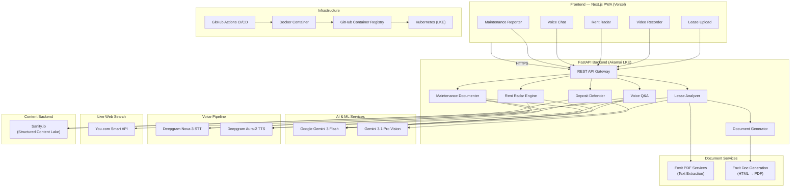

# LeaseGuard — AI-Powered Tenant Protection Platform


Every year, millions of renters lose money to illegal lease clauses, unfair deposit deductions, and above-market rent — simply because they don't understand the dense legal language in their contracts. LeaseGuard puts a digital tenant rights attorney in every renter's pocket.

Built as a Progressive Web App, LeaseGuard uses AI to read, analyze, and act on lease documents — generating legal counter-letters, researching live market data, and producing professional PDFs — all from a phone.

**Live Demo:** [lease-guard-three.vercel.app](https://lease-guard-three.vercel.app)

---

## Architecture



---

## Features

### 1. Legal Shield — Lease Clause Analysis

Upload a lease PDF. Foxit PDF Services extracts the text, Google Gemini analyzes every clause against your state's tenant laws, and the results are stored in Sanity as structured, queryable data. Each clause gets a risk rating (green / yellow / red) with a plain-English explanation and legal citation. You can generate a formal counter-letter PDF for any risky clause — citing the exact law being violated.

**API flow:** `Upload PDF → Foxit Extract → Gemini Analysis → Sanity Storage → Foxit DocGen (Counter-Letter PDF)`

### 2. Deposit Defender — Move-In Video Inspection

Record a video walkthrough with your phone's camera. OpenCV extracts key frames, and Gemini 3.1 Pro Vision analyzes each frame to detect scratches, stains, water damage, mold, and other pre-existing defects. The findings are compiled into a timestamped Condition Report stored in Sanity and available as a downloadable PDF.

**API flow:** `Video → OpenCV Frame Extraction → Gemini Vision → Sanity Storage → Foxit DocGen (Condition Report PDF)`

### 3. Rent Radar — Live Market Comparison

Enter your city, zip code, and current rent. The You.com Smart Search API queries the real-time web for comparable listings and average rent data. Gemini parses the search results into structured market statistics. If you're overpaying, a professional negotiation letter is generated as a PDF backed by the live data.

**API flow:** `User Input → You.com Search → Gemini Parse → Foxit DocGen (Negotiation Letter PDF)`

### 4. Voice Chat — Talk to Your Lease

Ask questions like "Can my landlord charge me for carpet cleaning?" using your microphone. Deepgram Nova-3 transcribes the audio, Gemini answers the question using stored lease context from Sanity, and Deepgram Aura-2 reads the answer back to you.

**API flow:** `Audio → Deepgram STT → Gemini (with Sanity lease context) → Deepgram TTS → Audio Response`

### 5. Maintenance Reporter — Voice-First Repair Requests

Describe a maintenance issue by voice. Deepgram transcribes with Audio Intelligence (topic detection, intent recognition, summarization). Gemini structures the transcript into a formal maintenance request with categorization, urgency, and safety flags. The result is generated as a professional PDF and read back via TTS.

**API flow:** `Audio → Deepgram Intelligence → Gemini Structuring → Foxit DocGen (Request PDF) → Deepgram TTS`

---

## Tech Stack

| Layer | Technology | How It's Used |
|-------|-----------|---------------|
| Frontend | Next.js 16, React 19, PWA | Installable mobile-first app with offline support |
| Backend | FastAPI, Python | REST API with 6 route modules |
| AI / Analysis | Google Gemini 3 Flash | Lease analysis, rent parsing, chat, structuring |
| Computer Vision | Gemini 3.1 Pro Vision, OpenCV | Defect detection from video frames |
| Speech-to-Text | Deepgram Nova-3 | Voice chat transcription |
| Audio Intelligence | Deepgram Nova-2 | Maintenance request: topics, intents, summarization |
| Text-to-Speech | Deepgram Aura-2 | Voice responses and read-aloud |
| PDF Extraction | Foxit PDF Services API | Lease PDF → plain text |
| PDF Generation | Foxit Document Generation API | Counter-letters, negotiation letters, condition reports, maintenance requests |
| Live Web Search | You.com Smart API | Real-time rent comparables and rent law research |
| Content Backend | Sanity.io | Structured storage for analyses, reports, and lease data |
| Frontend Hosting | Vercel | Automatic deployments from GitHub |
| Backend Hosting | Akamai Cloud / Linode Kubernetes Engine | Containerized backend with rolling deployments |
| CI/CD | GitHub Actions | Auto-build Docker images on push to `main` |
| Container Registry | GitHub Container Registry (ghcr.io) | Stores production Docker images |

---

## Project Structure

```
lease-guard/
├── frontend/                   # Next.js 16 PWA
│   ├── src/app/                # Pages: upload, leases, analysis, rent, deposit, maintenance, chat
│   ├── src/components/         # RentCalculator, VoiceChat, VideoRecorder, CounterLetterButton
│   └── src/lib/                # API client, lease localStorage, Sanity config
├── backend/                    # FastAPI Python backend
│   ├── app/routes/             # upload, documents, deposit, chat, rent, maintenance
│   ├── app/lease_analysis/     # Gemini-powered lease analyzer
│   ├── app/rent_radar/         # You.com + Gemini rent comparables
│   ├── app/deposit_defender/   # OpenCV + Gemini Vision defect detection
│   ├── app/chat/               # Deepgram STT/TTS + Gemini voice Q&A
│   ├── app/voice_qa/           # Maintenance request documenter
│   ├── app/documents/          # Foxit PDF Services + Document Generation
│   └── app/sanity_client/      # Sanity.io CRUD operations
├── k8s/                        # Kubernetes deployment manifests
├── sanity/                     # Sanity Studio (content management)
└── docker-compose.yml          # Local development environment
```

---

## Getting Started

### Prerequisites

- Docker & Docker Compose
- Node.js 18+
- Python 3.10+

### Environment Variables

```bash
# backend/.env
GEMINI_API_KEY=...
DEEPGRAM_API_KEY=...
FOXIT_CLIENT_ID=...
FOXIT_CLIENT_SECRET=...
FOXIT_API_BASE_URL=https://developer-api.foxit.com
YOU_COM_API_KEY=...
SANITY_PROJECT_ID=...
SANITY_DATASET=production
SANITY_API_TOKEN=...

# frontend/.env
NEXT_PUBLIC_SANITY_PROJECT_ID=...
NEXT_PUBLIC_SANITY_DATASET=production
BACKEND_URL=http://localhost:8000
```

### Run Locally

```bash
docker-compose up --build
```

- Frontend: [http://localhost:3000](http://localhost:3000)
- Backend API Docs: [http://localhost:8000/docs](http://localhost:8000/docs)

### Deploy to LKE

```bash
export KUBECONFIG=lke-kubeconfig.yaml
kubectl apply -f k8s/
```

---

## Hackathon Track Eligibility

This project was built for the **DeveloperWeek 2026 Hackathon** and qualifies for multiple sponsor challenges:

| Track | Eligibility |
|-------|-------------|
| **Foxit Software** | Uses both Foxit PDF Services (text extraction) AND Document Generation (4 distinct PDF types) |
| **You.com** | Uses You.com Smart API for live rent market research with citation-backed results |
| **Akamai / Linode** | Backend runs on Linode Kubernetes Engine with Docker + GitHub Actions CI/CD |
| **Deepgram** | Uses Nova-3 STT, Nova-2 Audio Intelligence, and Aura-2 TTS across 3 features |
| **Sanity** | Uses Sanity.io as structured content backend — lease analyses are queryable by clause type, risk level, and state |

---

## License

MIT License.
